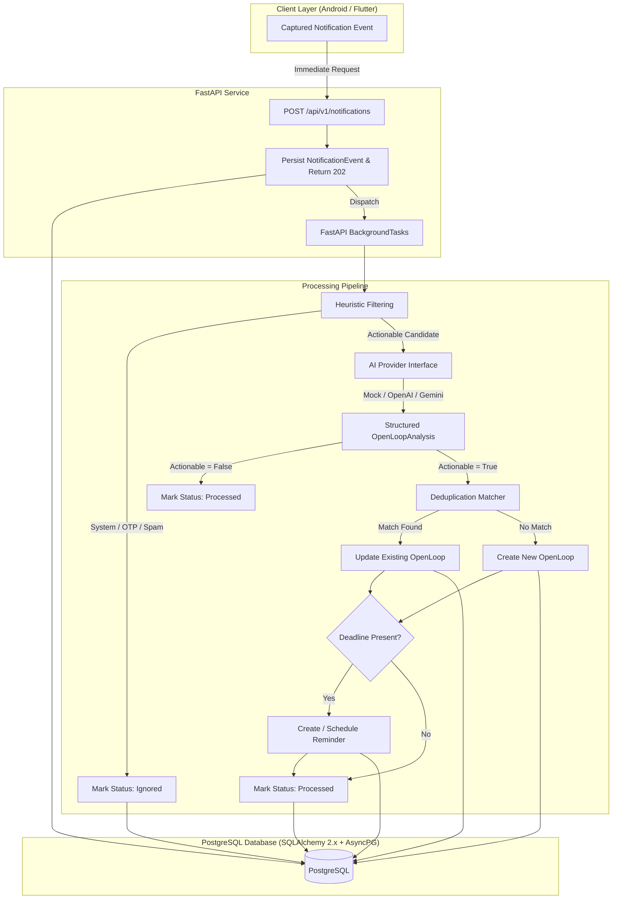

# AI Open-Loop Reminder Backend

A production-quality, lightweight backend service for an AI-powered reminder application. It ingests notifications captured from a user's smartphone (WhatsApp, Slack, Gmail, etc.), analyzes message content with AI, detects actionable **"open loops"** (tasks, commitments, follow-ups), extracts structured entities (task title, person, normalized deadlines, priority), and manages reminders with smart deduplication.

---

## Architecture Overview



---

## Core Technologies

* **Language & Framework**: Python 3.12+, FastAPI, Uvicorn
* **Database**: PostgreSQL 16+, SQLAlchemy 2.0 (AsyncIO), AsyncPG driver
* **Migrations**: Alembic with full async support
* **Validation & Settings**: Pydantic v2 & Pydantic-Settings
* **HTTP Client**: HTTPX (async external LLM requests)
* **Date & Time Normalization**: `python-dateutil`, `pytz` (resolves relative terms like `"tomorrow"`, `"next week"`, `"after 6"` to UTC)
* **Testing**: pytest, pytest-asyncio, pytest-cov, aiosqlite (in-memory async tests)
* **Containerization**: Docker multi-stage build + docker-compose

---

## Project Structure

```text
open-loop-backend/
├── app/
│   ├── main.py                        # FastAPI entrypoint, lifespan, CORS, middleware
│   ├── api/
│   │   ├── dependencies.py            # Dependency injection (DB sessions, services)
│   │   └── routes/
│   │       ├── health.py              # Health check endpoints (/health, /health/db)
│   │       ├── notifications.py       # Notification ingestion & querying
│   │       ├── open_loops.py          # Open-loop lifecycle APIs (list, update, complete, dismiss)
│   │       └── reminders.py           # Reminder CRUD & cancellation APIs
│   ├── core/
│   │   ├── config.py                  # Pydantic BaseSettings environment configuration
│   │   ├── database.py                # Async engine & sessionmaker
│   │   ├── exceptions.py              # Centralized domain exceptions & HTTP handlers
│   │   └── logging.py                 # Structured JSON / formatted logging
│   ├── models/
│   │   ├── base.py                    # Cross-platform GUID type decorator
│   │   ├── user.py                    # User model with timezone support
│   │   ├── device.py                  # Client device model (android, ios)
│   │   ├── notification_event.py      # Raw notification event with idempotency constraint
│   │   ├── open_loop.py               # Actionable obligations with status tracking
│   │   └── reminder.py                # Scheduled reminders linked to open loops
│   ├── schemas/
│   │   ├── ai.py                      # OpenLoopAnalysis structured AI output schema
│   │   ├── notification.py            # Ingestion request / response schemas
│   │   ├── open_loop.py               # Open-loop schemas
│   │   ├── reminder.py                # Reminder schemas
│   │   └── common.py                  # Pagination and error envelopes
│   ├── services/
│   │   ├── date_service.py            # Relative date parser & timezone normalizer
│   │   ├── filter_service.py          # Cheap heuristic filter (OTPs, system alerts, spam)
│   │   ├── notification_service.py    # Notification ingestion & background pipeline
│   │   ├── open_loop_service.py       # Deduplication matching & state transitions
│   │   ├── reminder_service.py        # Reminder scheduling & management
│   │   └── ai/
│   │       ├── base.py                # AIProvider abstract base class
│   │       ├── mock.py                # Deterministic rule-based mock provider
│   │       ├── openai_provider.py     # OpenAI structured JSON API provider
│   │       ├── gemini_provider.py     # Google Gemini API provider
│   │       └── provider.py            # Provider factory singleton
│   └── scripts/
│       └── seed.py                    # Demo database seeding script
├── alembic/
│   ├── env.py                         # Async Alembic runner
│   └── versions/
│       └── 001_initial_schema.py      # Initial schema migration
├── tests/
│   ├── conftest.py                    # Pytest async SQLite fixtures & TestClient
│   ├── test_ai_mock.py                # Deterministic AI analyzer tests
│   ├── test_ai_pipeline.py            # End-to-end background ingestion tests
│   ├── test_date_service.py           # Relative date parsing tests
│   ├── test_deduplication.py          # Follow-up message deduplication tests
│   ├── test_filtering.py              # Heuristic package and regex filter tests
│   ├── test_health.py                 # Health and DB connectivity tests
│   ├── test_notifications.py          # Notification ingestion & idempotency tests
│   ├── test_open_loops.py             # Open loop CRUD & status transition tests
│   ├── test_reminders.py              # Reminder management tests
│   ├── test_seed.py                   # Seed script verification test
│   └── test_validation_and_errors.py  # Error handling and validation tests
├── Dockerfile                         # Multi-stage production container
├── docker-compose.yml                 # PostgreSQL + Backend composition
├── requirements.txt                   # Locked production dependencies
├── pyproject.toml                     # Project packaging & dependencies
├── .env.example                       # Sample environment configuration
└── README.md
```

---

## Getting Started

### 1. Running with Docker Compose (Recommended)

Start the PostgreSQL database and backend service:

```bash
docker compose up --build
```

The service will automatically:
1. Wait for PostgreSQL to become healthy.
2. Run database migrations via `alembic upgrade head`.
3. Launch FastAPI on `http://localhost:8000`.

Interactive Swagger documentation is available at:
* **Swagger UI**: [http://localhost:8000/docs](http://localhost:8000/docs)
* **ReDoc**: [http://localhost:8000/redoc](http://localhost:8000/redoc)

---

### 2. Local Development Setup (uv / Python)

#### Prerequisites
* Python 3.12+
* `uv` package manager (or standard venv)

#### Install Dependencies
```bash
uv sync
```

#### Environment Configuration
```bash
cp .env.example .env
```

#### Run Database Migrations
```bash
uv run alembic upgrade head
```

#### Seed Demo Data
To populate sample users, devices, and realistic notifications:
```bash
uv run python -m app.scripts.seed
```

#### Start Local Server
```bash
uv run uvicorn app.main:app --reload --port 8000
```

---

## Running Tests

Run the test suite with coverage reporting:

```bash
uv run pytest --cov=app --cov-report=term-missing
```

All tests run asynchronously against an in-memory SQLite database without requiring an external PostgreSQL instance or third-party LLM API keys.

---

## AI Provider Configuration

The backend abstracts AI extraction behind the `AIProvider` interface. You can configure which provider to use via the `AI_PROVIDER` environment variable.

### 1. Mock Provider (`AI_PROVIDER=mock`)
Default mode for local development and testing. Runs with zero external dependencies and deterministically categorizes key scenarios:
* `"Can you send me the investor deck tomorrow?"` → **Actionable**: Task: `"Send the investor deck"`, Deadline: tomorrow 17:00 UTC.
* `"lol that's hilarious 😂"` → **Non-Actionable**: Ignored.
* `"Let's catch up sometime next week."` → **Actionable**: Task: `"Catch up"`, Deadline: next week.
* `"Hey, just checking on that deck."` → **Actionable**: Matches and updates existing open loop.
* `"Please call me after 6."` → **Actionable**: Task: `"Call sender"`, Deadline: 18:00 local time.

### 2. OpenAI Provider (`AI_PROVIDER=openai`)
```env
AI_PROVIDER=openai
AI_API_KEY=sk-your-openai-key-here
AI_MODEL=gpt-4o-mini
```

### 3. Google Gemini Provider (`AI_PROVIDER=gemini`)
```env
AI_PROVIDER=gemini
AI_API_KEY=AIzaSy-your-gemini-key-here
AI_MODEL=gemini-1.5-flash
```

---

## API Walkthrough & Examples

### 1. Notification Ingestion (Idempotent & Non-Blocking)

**Request:**
```http
POST /api/v1/notifications HTTP/1.1
Host: localhost:8000
Content-Type: application/json

{
  "user_id": "11111111-1111-1111-1111-111111111111",
  "device_id": "22222222-2222-2222-2222-222222222222",
  "client_event_id": "client-msg-001",
  "source_app": "WhatsApp",
  "source_package": "com.whatsapp",
  "sender": "Rahul",
  "title": "Rahul",
  "body": "Can you send me the investor deck tomorrow?",
  "received_at": "2026-08-19T12:00:00Z"
}
```

**Immediate Response (HTTP 202 Accepted):**
```json
{
  "event_id": "e45873bf-3e4b-4c07-8822-79013c7263b6",
  "status": "processing"
}
```

---

### 2. Querying Open Loops

**Request:**
```http
GET /api/v1/open-loops?user_id=11111111-1111-1111-1111-111111111111&status=open HTTP/1.1
Host: localhost:8000
```

**Response:**
```json
{
  "items": [
    {
      "id": "787fecbc-b349-410a-9d90-0c4aa30560a6",
      "user_id": "11111111-1111-1111-1111-111111111111",
      "source_notification_id": "e45873bf-3e4b-4c07-8822-79013c7263b6",
      "task": "Send the investor deck",
      "person": "Rahul",
      "deadline": "2026-08-20T21:00:00Z",
      "deadline_text": "tomorrow",
      "importance": "medium",
      "confidence": 0.96,
      "reason": "The sender explicitly requested an action.",
      "status": "open",
      "created_at": "2026-08-19T12:00:01.123456Z",
      "updated_at": "2026-08-19T12:00:01.123456Z",
      "completed_at": null
    }
  ],
  "total": 1,
  "limit": 20,
  "offset": 0
}
```

---

### 3. Deduplication & Updating with Follow-Up Message

When a follow-up message arrives regarding the same topic:

**Request:**
```http
POST /api/v1/notifications HTTP/1.1
Host: localhost:8000
Content-Type: application/json

{
  "user_id": "11111111-1111-1111-1111-111111111111",
  "source_app": "WhatsApp",
  "source_package": "com.whatsapp",
  "sender": "Rahul",
  "title": "Rahul",
  "body": "Hey, just checking on that deck.",
  "received_at": "2026-08-19T15:00:00Z"
}
```

The backend automatically identifies the matching open loop (same user, same person, overlapping task concepts), updates the existing `OpenLoop`'s timestamp, source notification, and reason rather than creating a duplicate task.

---

### 4. Completing an Open Loop

**Request:**
```http
POST /api/v1/open-loops/787fecbc-b349-410a-9d90-0c4aa30560a6/complete HTTP/1.1
Host: localhost:8000
```

**Response:**
```json
{
  "id": "787fecbc-b349-410a-9d90-0c4aa30560a6",
  "status": "completed",
  "completed_at": "2026-08-19T18:00:00Z"
}
```

---

## Key Design Decisions & Future Extension

1. **Job Queue Readiness**: Background processing is decoupled inside `process_notification_background(event_id)`. Moving to Celery, ARQ, or Kafka requires only swapping the background task dispatch in `notification_service.py` without touching business logic.
2. **Push Notifications**: When ready for Firebase Cloud Messaging (FCM), a notification worker can query `/api/v1/reminders` where `status = 'scheduled' AND scheduled_for <= NOW()` and trigger device pushes.
3. **Semantic Matching**: Deduplication uses token similarity and entity matching today; the service interface enables plugging in pgvector embeddings seamlessly when scale demands.
